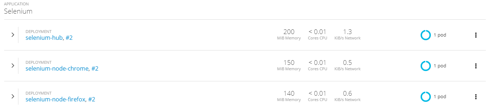
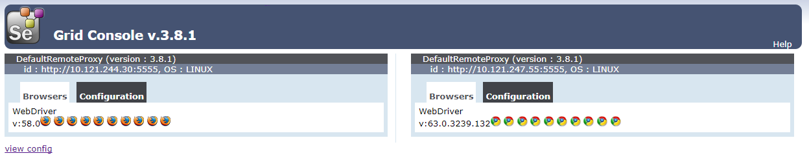
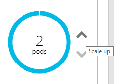
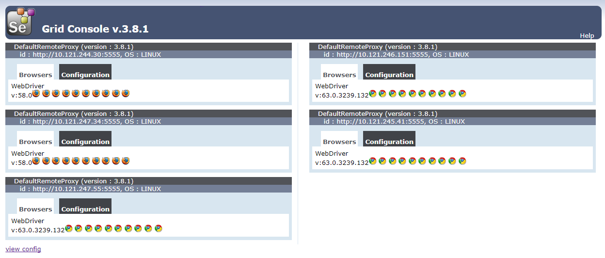
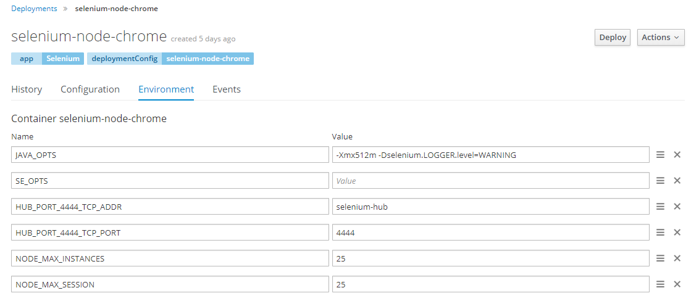
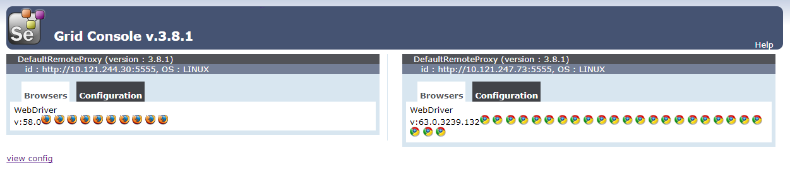

An OpenShift/Kubernetes template to deploy Selenium Grid Server on OpenShift. It will start a Hub, a Chrome and a Firefox nodes and connect them to the Hub.

# Table of Contents

- [How to use?](#how-to-use)
    - [Import the template](#import-the-template)
    - [Concurrency](#concurrency)
    - [Scale-up](#scale-up)
    - [Auto-scale](#auto-scale)
    - [Oops, I messed up everything!](#oops-i-messed-up-everything)
- [What is Selenium?](#what-is-selenium)
- [Supported browsers](#supported-browsers)
- [Contributing](#contributing)
- [Credits](#credits)

# How to use?

## Build the images
Form your OpenShift console, import [`./build-images.yaml`](./build-images.yaml), and build the different images.

lternatively, you can login to OpenShift via the `oc` command line:
```bash
$ oc login
```
and import it with:
```bash
$ oc create -f openshift/build-images.yaml
```

## Import the template
Import the [`./selenium-grid.yaml` template](./selenium-grid.yaml) in OpenShift. 

Or with the command line:
```bash
$ oc login
```
and import it with:
```bash
$ oc create -f openshift/selenium-grid.yaml
```

Wait a few seconds for the three deployments to startup, and ... voilà! Your Selenium Grid server is up and running.

*Note that the path `/grid/console` only lets you view your grid from a browser.
Most webdrivers will need to be configured at the subpath `/wd/hub`.*

From OpenShift, your grid should look like this:  


And from Selenium, it should look like that:


Tasty! 🍬

## Concurrency
The grid is pre-configured to register one node dedicated to Chrome tests, and one
node for Firefox tests. The Chrome node can start up to 3 Chrome instances in 
parallel, and same for Firefox.  
It means that:
- 3 users can execute tests on Chrome at the same time (*same for Firefox*)
- 1 user can split a long-running test over 3 Chrome instances in order to test
3 times faster (*same for Firefox*)
- any other combination

## Scaling up
Having 3 instances is nice, but what if you need more?   
You can scale-up the grid in two different ways.

### Multiplying the nodes
You can add new nodes to the grid by directly scaling-up the associated 
OpenShift deployments, like so:  


And now from Selenium, your grid should look like this:  


Now you have 30 Chrome and 20 Firefox instances. Wow!

### Enlarging the nodes
Alternatively, you can increase the capacity of an existing node by setting the 
environment variables `NODE_MAX_INSTANCES` and `NODE_MAX_SESSION` on its 
Deployment:


Save, wait for the re-deployment, and check your grid:


*So which one should you do?*  
The choice is entirely up to you, depending on your needs and the resources you
want to allocate. But keep in mind that you'd rather a few nodes using all their
CPU and RAM than a lot of node underusing their resources.

## Auto-scale

@TODO Implement auto-scaling

## Oops, I messed up everything!
Don't worry, you can easily perform a full cleanup and start over again.

Just make sure you are logged in by opening a command and running:
```bash
oc login
```
and then run the commands available in [`./openshift/clear_selenium-grid.bat`](./openshift/clear_selenium-grid.bat).

# What is Selenium?
_Selenium automates browsers._ That's it! What you do with that power is 
entirely up to you. Primarily, it is for automating web applications for testing
purposes, but is certainly not limited to just that. Boring web-based 
administration tasks can (and should!) also be automated as well.

Selenium has the support of some of the largest browser vendors who have taken 
(or are taking) steps to make Selenium a native part of their browser. It is 
also the core technology in countless other browser automation tools, APIs and 
frameworks.

See the Selenium [site](http://docs.seleniumhq.org/) for documentation on usage 
within your test code.

# Contributing
Heck! Your favorite browser/version is not supported? Or want to improve the project in 
any other way?
Your contribution is more than welcome!

# Credits
_Credits to the [Selenium community's hard work](https://github.com/SeleniumHQ/docker-selenium/tree/master/Base) and especially [ddavidson](https://github.com/ddavison) and [Jeroen Wolff](https://github.com/jr00n) from whom the Docker images and templates are adapted._
